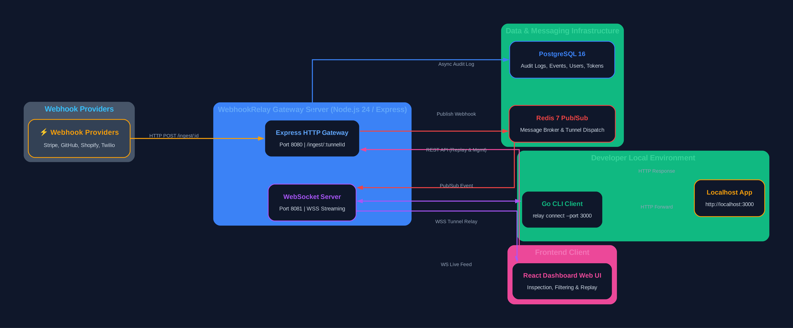

# Webhook Relay

[](https://github.com/Ahsan-Qamar-47/webhookrelay/actions/workflows/cli.yml)
[](https://github.com/Ahsan-Qamar-47/webhookrelay/actions/workflows/server.yml)
[](https://github.com/Ahsan-Qamar-47/webhookrelay/actions/workflows/web.yml)

A high-performance, developer-first, self-hostable webhook tunneling and inspection framework. Webhook Relay exposes your local development environment (`localhost`) to third-party webhook providers (Stripe, GitHub, Shopify, Twilio) with real-time inspection, payload replaying, and sub-50ms latency.

---

## 🏛️ Architecture Overview



### 📐 Detailed Architectural & Protocol Specifications

- **[System Overview Architecture](docs/architecture/system-overview.png)**
- **[Data Flow Diagram (Level 0 & 1)](docs/architecture/dfd.png)**
- **[Database Entity-Relationship (ER) Diagram](docs/architecture/er-diagram.png)**
- **[Signup & Endpoint Provisioning Sequence Diagram](docs/architecture/seq-signup.png)**
- **[Webhook Ingress to CLI Replay Sequence Diagram](docs/architecture/seq-ingest-replay.png)**
- **[UI Real-time Dashboard Updates Sequence Diagram](docs/architecture/seq-realtime.png)**
- **[REST API Specification](docs/api/rest-spec.md)**
- **[WebSocket Protocol Specification](docs/api/ws-protocol.md)**
- **[Interactive OpenAPI/Swagger UI](http://localhost:8080/api/docs)**

```
                          +-------------------------+
                          | Webhook Providers       |
                          | (Stripe, GitHub, etc.)  |
                          +------------+------------+
                                       |
                                       | HTTP POST /ingest/:tunnelId
                                       v
                          +-------------------------+
                          | Express HTTP Gateway    |
                          | (Port 8080)             |
                          +------------+------------+
                                       |
                   +-------------------+-------------------+
                   |                                       |
                   v                                       v
        +---------------------+                 +---------------------+
        | Redis Pub/Sub       |                 | PostgreSQL 16       |
        | (Message Broker)    |                 | (Audit Logs & State)|
        +----------+----------+                 +---------------------+
                   |
                   v
        +---------------------+
        | WebSocket Server    |
        | (Port 8081)         |
        +----------+----------+
                   |
                   | WSS Tunnel Connection
                   v
        +---------------------+                 +---------------------+
        | Go CLI Client       |                 | React Dashboard UI  |
        | (relay connect)     |                 | (Live Event Viewer) |
        +----------+----------+                 +---------------------+
                   |
                   | Forward Request
                   v
        +---------------------+
        | Local Application   |
        | (localhost:3000)    |
        +---------------------+
```

---

## 🛠️ Tech Stack

| Layer | Technologies | Purpose |
| :--- | :--- | :--- |
| **CLI Client** | Go 1.26, Cobra CLI | High-performance binary for local port forwarding and tunneling. |
| **Backend Gateway** | Node.js 24, Express, `ws` | HTTP ingress gateway and WebSocket connection handling. |
| **Web Dashboard** | React 19, Vite, TailwindCSS | Real-time browser UI for inspecting, filtering, and replaying webhooks. |
| **Message Broker** | Redis 7 (Pub/Sub) | Decouples HTTP ingestion from WebSocket client connections. |
| **Database** | PostgreSQL 16 | Persistent historical audit log for webhook requests and responses. |
| **Orchestration** | Docker, Docker Compose | Unified local development database environment. |
| **CI/CD Pipeline** | GitHub Actions | Parallel automated testing, linting, and build verification. |

---

## 📂 Monorepo Structure

```
webhookrelay/
├── .github/
│   └── workflows/          # GitHub Actions CI Workflows
│       ├── cli.yml         # Go CLI formatting, vet, test & build
│       ├── server.yml      # Express server linting & Jest/Node tests
│       └── web.yml         # React web linting & Vite build
├── cli/                    # Go Command Line Interface
│   ├── bin/                # Compiled binary outputs
│   ├── cmd/                # Cobra commands (root, connect, version)
│   ├── go.mod              # Go module definition
│   └── main.go             # CLI entrypoint
├── docs/                   # Documentation, Specifications & Reports
│   ├── api/                # REST & WebSocket protocol specs
│   │   ├── rest-spec.md    # REST API contracts (11 endpoints)
│   │   └── ws-protocol.md  # WebSocket framing protocol specification
│   ├── architecture/       # System diagrams & sequence flows
│   └── week-reports/       # Weekly progress engineering reports
│       ├── week-01.md      # Week 1 completion report
│       └── week-02.md      # Week 2 completion report
├── server/                 # Node.js Express & WebSocket Gateway
│   ├── db/
│   │   └── migrations/     # PostgreSQL 16 schema SQL migrations (001-005)
│   ├── src/
│   │   ├── config/         # App configuration & OpenAPI Swagger setup
│   │   ├── routes/         # HTTP API routes (/health, /ingest, /api/docs)
│   │   ├── ws/             # WebSocket tunnel connection handler
│   │   └── index.js        # Express & WS server entrypoint
│   ├── test/               # Node test suites
│   ├── package.json        # Server dependencies & scripts
│   └── .env.example        # Environment variable configuration
├── web/                    # React Web Inspection Dashboard
│   ├── src/                # UI components & state management
│   ├── index.html          # Dashboard HTML template
│   └── package.json        # Frontend dependencies & scripts
├── docker-compose.yml      # Postgres 16 & Redis 7 stack configuration
├── Makefile                # Unified developer project commands
└── README.md               # Repository documentation
```

---

## ⚡ Quickstart Commands

### Prerequisites
- **Go 1.26+**
- **Node.js 24+**
- **Docker & Docker Compose**

### 1. Setup Dependencies & Environment
```bash
# Clone the repository
git clone https://github.com/Ahsan-Qamar-47/webhookrelay.git
cd webhookrelay

# Install dependencies across server, web, and cli
make install

# Start PostgreSQL and Redis infrastructure containers
make db
```

### 2. Build & Run Components
```bash
# Build the Go CLI binary
make cli

# Run CLI version check
./cli/bin/relay version

# Start Backend Server (HTTP :8080 & WS :8081)
cd server && npm run dev

# Start Web Dashboard (Vite :5173) in a separate terminal
cd web && npm run dev
```

### 3. Verification & Testing
```bash
# Verify health endpoint
curl http://localhost:8080/health

# Simulate an incoming webhook ingest
curl -X POST http://localhost:8080/ingest/demo-tunnel \
  -H "Content-Type: application/json" \
  -d '{"event":"user.created","id":101}'

# Execute unit test suites
make test
```

---

## 📅 16-Week Project Roadmap

| Phase | Timeline | Focus Area | Key Milestones & Deliverables |
| :--- | :--- | :--- | :--- |
| **Phase 1** | **Weeks 1–4** | **Core Monorepo & Tunneling** | Monorepo setup, CI/CD, Go CLI connection engine, Express HTTP Ingress, Redis Pub/Sub integration, WSS streaming. |
| **Phase 2** | **Weeks 5–8** | **Inspection UI & Webhook Replay** | React dashboard, live stream event view, body/header diffing, payload modification, single-click replay functionality. |
| **Phase 3** | **Weeks 9–12** | **Auth, Multi-Tenancy & Security** | Token authentication, custom subdomains, secret masking, Postgres event audit retention, rate limiting. |
| **Phase 4** | **Weeks 13–16** | **Cloud Deploy & Monetization** | Helm chart / Docker distribution, usage metering, SaaS billing integration, docs polish & v1.0 Release. |

---

## 💎 Monetization Tiers

| Feature / Capability | Developer (Free) | Team ($19/mo) | Enterprise ($99/mo) |
| :--- | :---: | :---: | :---: |
| **Active Tunnels** | 2 Concurrent | 10 Concurrent | Unlimited |
| **Monthly Webhook Volume** | 10,000 / month | 250,000 / month | 5,000,000+ / month |
| **Event History Retention** | 24 Hours | 30 Days | 365 Days |
| **Custom Subdomains** | ❌ | ✅ (`team.relay.dev`) | ✅ Dedicated Domain |
| **Payload Replay & Inspection**| Basic | Advanced | Custom Transformer Rules |
| **Team Collaboration** | 1 User | Up to 10 Users | Unlimited Users |
| **Support SLA** | Community (GitHub) | Priority Email | 24/7 Dedicated SLA |

---

## 📄 License

This project is licensed under the [MIT License](LICENSE).
